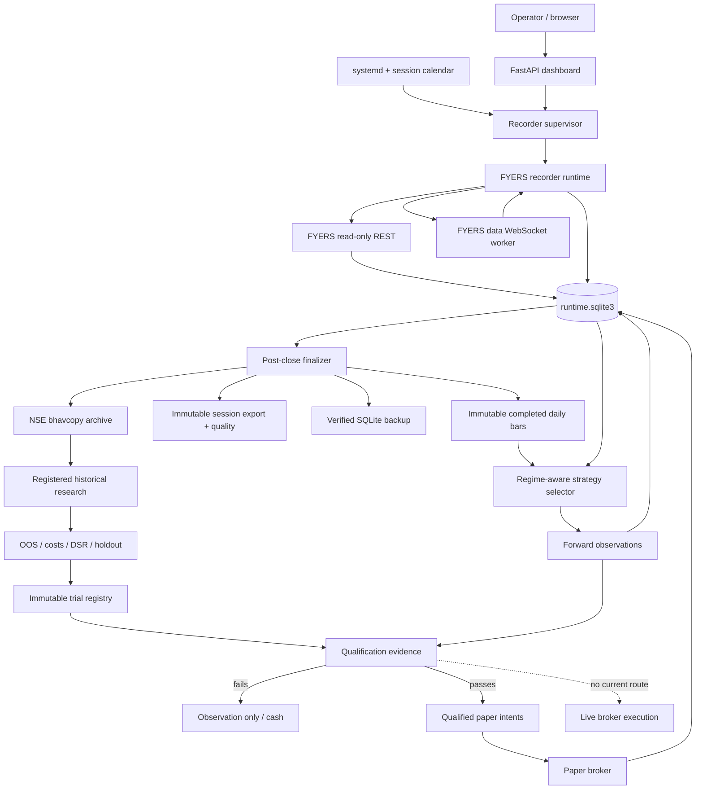
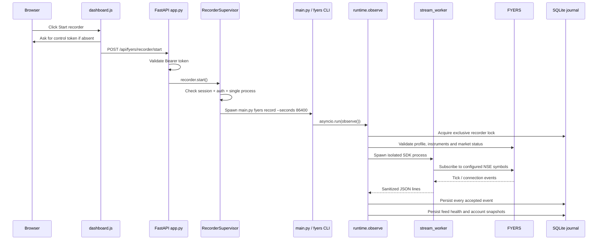
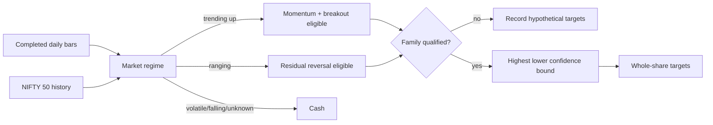
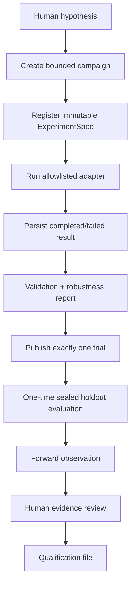

# AlgoTrader codebase guide

Updated: 2026-09-21.

This is the end-to-end map of the repository, with emphasis on the active FYERS/NSE
system. It explains what runs, where each responsibility lives, how data moves, how
research becomes qualified paper trading, where a small model can fit, and what must
happen before live execution. It is a code map, not evidence that any strategy is
profitable.

## 1. The system in one picture



The governing boundary is:

```text
market data → strategy → signal/target → qualification and deterministic risk
→ intent → paper execution → fill → ledger → reconciliation
```

A strategy or model never calls FYERS directly. The current FYERS integration has
no enabled route for submitting real orders.

## 2. Runtime states

| Dashboard state | Meaning |
|---|---|
| `AUTH_REQUIRED` | FYERS rejected the access token; operator login is required. |
| `PREOPEN` | Valid reviewed trading day, before the configured session. |
| `RECORDING` | FYERS stream and account/session monitoring subprocess are running. No trade is implied. |
| `FINALIZING` | The completed session is being converted into daily bars, evidence and a backup. |
| `RESEARCH_READY` | Post-close artifacts exist and may be used for observation/research. |
| `OBSERVATION_ONLY` | Strategies may produce hypothetical decisions, but cannot create paper entries. |
| `QUALIFIED_PAPER` | Hash-bound qualification passes; paper intents may be scheduled. |

`live_enabled` remains `false` in every state.

## 3. What happens when “Start recorder” is clicked



File-by-file:

1. `src/dashboard/static/js/dashboard.js`
   - Handles the button.
   - Keeps the bearer token only in page memory.
   - Calls `POST /api/fyers/recorder/start` or `/stop`.
2. `src/dashboard/app.py`
   - Enforces the bearer token for every mutation.
   - Calls `RecorderSupervisor.start()`.
   - Contains no order-placement or live-enable endpoint.
3. `src/fyers/supervisor.py`
   - Checks the reviewed NSE calendar, configured time window, authentication state,
     manual-stop state and restart budget.
   - Starts one subprocess: `main.py fyers record --seconds 86400`.
   - Persists supervisor state so restarts do not erase operational history.
4. `main.py` and `src/fyers/cli.py`
   - Route `fyers record` to `src.fyers.runtime.observe()`.
5. `src/fyers/runtime.py`
   - Takes an exclusive database lock so two recorders cannot run.
   - Resolves the FYERS instrument master and validates the account token.
   - Starts account/market-status polling and the isolated stream worker.
   - Validates ordering, freshness and executable quote fields.
   - Writes ticks, health, connection events and account counts to SQLite.
   - If qualified scheduled intents exist, passes them only to the paper broker.
6. `src/fyers/stream_worker.py`
   - Owns the official FYERS WebSocket SDK in an isolated process.
   - Emits only allowlisted market fields as JSON lines.
   - Suppresses SDK messages that could expose credentials.
7. `src/fyers/journal.py`
   - Stores the event stream and durable paper/accounting state in SQLite WAL mode.

The supervisor also performs the same start automatically. With the current config,
it checks every 30 seconds, records between 09:10 and 15:35 IST on reviewed trading
days, stays idle on weekends/holidays, and uses bounded restart attempts.

## 4. Market-data flow and storage

### Intraday stream

```text
FYERS WebSocket
  → allowlisted tick fields
  → bounded asyncio queue
  → validation/freshness checks
  → events table in data/fyers/runtime.sqlite3
  → dashboard quote projection and session-quality calculations
```

Important behavior:

- Raw credentials and sensitive FYERS responses are not journalled.
- Exchange and receive timestamps are retained to measure latency.
- One-sided, crossed, stale, future or missing books are never treated as fills.
- Queue overflow persists a halt because it means the recorder lost data.
- The recorder periodically verifies FYERS account counts and official NSE market
  status. It does not adopt broker positions into the paper ledger.

### Post-close data

After the configured delay, `RecorderSupervisor` calls
`src/fyers/operations.py::finalize_session()`:

1. `src/data/nse/bhavcopy.py` downloads the official NSE bhavcopy for historical
   point-in-time research.
2. `src/fyers/daily_data.py` requests bounded FYERS history for every configured
   stock and the broad-market benchmark.
3. It writes one immutable, hash-validated artifact per completed session under
   `data/fyers/daily-bars/YYYY-MM-DD.json`.
4. `src/data/session.py` exports the bounded intraday event window, the applicable
   instrument master and quality metrics to `data/fyers/sessions/YYYY-MM-DD.json`.
5. `src/fyers/operations.py` creates and verifies a SQLite backup under
   `data/fyers/backups/`.

The daily artifact records present bars, missing symbols, the universe hash, the
benchmark bar, capture time and a content hash. Strategy decisions consume completed
bars only; an incomplete current-day bar cannot influence a decision.

### SQLite contents

`data/fyers/runtime.sqlite3` contains:

| Table/state | Purpose |
|---|---|
| `events` | Ticks, connections, health, rejections, decisions, alerts and audit events. |
| `state` | Authentication, supervisor, cash, valuation, halt, preflight and finalization snapshots. |
| `positions`, `fills`, `paper_orders` | Persistent paper holdings and executions. |
| `tax_lots`, `realized_tax_lots` | FIFO cost basis and holding periods. |
| `settlement_obligations`, `dp_charges` | T+1 cash obligations and once-per-ISIN/day DP fees. |
| `regime_decisions` | One immutable selector decision per completed session. |
| `regime_forward_observations_v2` | Entry/due dates and forward net/benchmark/excess outcomes. |
| `scheduled_intents`, `paper_intent_dispatch` | Qualified target changes and their paper result. |

SQLite is the operational journal; immutable JSON/Parquet artifacts are research and
replay evidence. Both are backed up, but Azure off-site backup remains an external
deployment task.

## 5. How market data becomes a strategy decision

The active selector is in `src/strategies/nse_regime_selector.py`. It is deterministic,
long-only and uses an immutable 20-stock universe from
`config/nse_forward_universe.yaml`.



Regime inputs are lagged completed data:

- NIFTY level relative to its 200-day mean.
- NIFTY 60-day return.
- NIFTY 20-day annualized volatility versus its historical 80th percentile.
- Breadth: fraction of the stock universe above its 100-day mean.
- At least 253 bars, at least ten current constituents and minimum confidence.

Strategy families:

- `momentum_6_12`: combined 6/12-month return divided by annualized volatility.
- `donchian_breakout`: prior 55-day high breakout with a 200-day trend filter.
- `residual_reversal`: cross-sectional five-day residual reversal; research-only
  until independently qualified after full costs.

`src/shadow/continuous.py` runs alongside the dashboard. It:

- Loads completed bars and benchmark data.
- Evaluates observations whose NSE-session due date has arrived.
- Calls the regime selector.
- Creates scores and hypothetical whole-share targets.
- Caps the portfolio at five holdings and ₹2,000 per position.
- Records rejected/unaffordable symbols and immutable decision hashes.
- Schedules nothing unless the chosen family is already qualified.

This system does not autonomously invent strategies. New strategy ideas are human
specified, pre-registered, tested and reviewed.

## 6. Research lifecycle



Primary files:

- `src/research/models.py`: frozen experiment and output contracts. A v2 experiment
  includes hypothesis, strategy/version, universe, dates, train/validation/holdout
  boundaries, features, parameters/search space, benchmark, costs, slippage,
  artifacts, environment, seed, drawdown and rejection rules.
- `src/research/registry.py`: SQLite experiment/event registry, legal state
  transitions, campaign budgets, one-time holdout access and interruption audit.
- `src/research/adapters.py`: allowlisted deterministic backtest entrypoints.
  `bhavcopy_nse_regime` is the primary point-in-time NSE adapter;
  `csv_nse_regime` is a fixed-universe diagnostic.
- `src/backtest/nse_regime_backtest.py`: next-session execution, whole shares,
  corporate actions, costs and benchmark accounting.
- `src/research/runner.py`: verifies all registered file hashes, persists the result,
  publishes once to the full trial registry and never silently reruns an interrupted ID.
- `src/research/validation.py`: chronological periods, lookahead/warm-up integrity,
  block-bootstrap uncertainty, multiple-testing statistics and economic critique.
- `data/trials.json`: full immutable trial history, currently including 206 historical
  trials. Failed trials count; they are not deleted.

Research commands are under `main.py research ...`; operational commands are under
`main.py fyers ...`. See `docs/RESEARCH_PROCESS.md` for exact command syntax.

## 7. When a strategy qualifies

`src/fyers/qualification.py` recomputes the gate every time; it does not trust a
boolean written by a researcher. Evidence is stored in
`data/fyers/qualification.json` and must pass all of the following:

1. Exact FYERS strategy and registered trial identity.
2. Full trial-registry hash still matches.
3. Data, code, configuration and cost hashes still match.
4. At least 100 finite chronological net-return observations.
5. Deflated Sharpe probability greater than 0.95 against the full trial count.
6. Positive aggregate return in both halves of the series.
7. Positive untouched sealed-holdout benchmark excess.
8. At least 20 reviewed, non-overlapping forward portfolio observations spanning at
   least 182 days, bound to the selector hash.
9. Positive lower confidence bound for excess return.
10. Positive excess after FYERS charges, tax scenario and Azure infrastructure cost.
11. Approved investable benchmark artifact (`NIFTY200_MOMENTUM30_TRI` or `AMFI:*`).
12. Break-even capital no higher than configured capital.
13. Explicit human assertion that net costs and data were reviewed.

Changing any bound file invalidates the evidence and blocks new entries. No current
strategy passes this gate.

## 8. Qualified paper-trading flow

When a selected family eventually qualifies:

1. `ContinuousStrategyLab` computes the next-session target portfolio.
2. `src/shadow/scheduler.py::QualifiedIntentScheduler` rechecks qualification,
   persistent halt, instruments, integer quantities and lot sizes.
3. It writes idempotent `scheduled_intents`; it does not fill or submit anything.
4. `src/fyers/runtime.py` loads undispatched scheduled intents while recording.
5. `src/fyers/paper.py::PaperBroker` rechecks qualification for buys, market-open
   status, freshness, top-of-book liquidity, cash, notional and daily-loss limits.
6. Buys use ask plus adverse slippage; sells use bid minus adverse slippage. FYERS
   fees and DP charges are applied.
7. One atomic SQLite transaction updates cash, position, fill, paper order, FIFO tax
   lots, settlement obligation and valuation.
8. Duplicate intent IDs return the original fill and cannot charge twice.

Sells that reduce an existing paper holding remain possible when qualification later
expires or entries are halted, provided the quote and market checks pass. This avoids
turning an entry block into a forced inability to reduce risk.

## 9. Dashboard flow

`src/dashboard/templates/index.html` defines the page structure.
`src/dashboard/static/js/dashboard.js` polls `GET /api/fyers/dashboard` and renders
the snapshot. `src/fyers/dashboard.py` projects SQLite and artifact state into one
resilient payload; missing/corrupt sections appear as unavailable rather than crashing
the page.

Dashboard controls:

| Button | Endpoint | Effect |
|---|---|---|
| Start/stop recorder | `/api/fyers/recorder/start` or `/stop` | Controls data recording only. |
| Backup | `/api/fyers/backup` | Creates and verifies a local SQLite backup. |
| Halt entries | `/api/fyers/halt` | Persists an entry halt; does not liquidate. |

All mutations require `DASHBOARD_CONTROL_TOKEN`. There is intentionally no button or
route to qualify a strategy, enable live trading or submit an order.

## 10. Configuration map

| File | Controls |
|---|---|
| `config/fyers_runtime.yaml` | Symbols, database paths, capital/risk limits, session times, recorder supervision and finalization. |
| `config/fyers_strategy_lab.yaml` | Candidate lab, selector evidence and forward holding period. |
| `config/nse_forward_universe.yaml` | Reviewed forward stock universe and provenance. |
| `config/nse_holidays.yaml` | Fail-closed reviewed NSE calendar. Replace annually. |
| `config/fyers_costs.yaml` | Versioned FYERS fee assumptions. |
| `config/fyers_economics.yaml` | Tax and infrastructure-cost scenarios. |
| `config/fyers.yaml` | Allowlisted FYERS REST base URL and timeout. |
| `/etc/algotrader/fyers.env` | VM-only secrets and daily access token. Never commit. |

The Delta files under `src/core`, generic crypto strategies, `config/settings.yaml`
and `config/strategies.yaml` belong to the separate legacy crypto runtime. They are
not the active FYERS strategy path.

## 11. Deployment and automatic operation

`deploy/azure/install.sh` installs Python dependencies and renders systemd units:

- `fyers-dashboard.service`: dashboard, supervisor and continuous lab.
- `fyers-health.timer`: strict preflight at 08:45 IST and every 15 minutes during
  weekday operating hours.
- `fyers-backup.timer`: daily verified local backup around 18:00 IST.

The dashboard binds only to VM loopback `127.0.0.1:8000`; the operator uses an SSH
tunnel. FYERS authentication remains an explicit daily/operator action when the token
expires. `AUTH_REQUIRED` prevents a restart storm.

Preflight checks Python, external environment file and permissions, required values,
calendar year, database integrity, disk capacity, backup freshness, configuration
hashes, FYERS profile and registered outbound IP.

## 12. Adding a small intelligent model safely

The first useful model should be small, interpretable and advisory. A reasonable
starting point is regularized logistic regression that estimates the probability of a
positive five-session benchmark-relative return using only lagged features:

- Broad-index trend and 20-day volatility.
- Cross-sectional breadth.
- Stock 6/12-month momentum and recent residual return.
- Observed spread/data-quality features available before the decision timestamp.

It should not generate orders or optimize itself. Integration path:

```text
completed-bar artifact
→ deterministic feature builder
→ versioned model artifact
→ probability/score
→ existing regime/qualification/risk gates
→ hypothetical target
```

Implementation design:

1. Add a pure feature builder that accepts only a bounded completed-bar artifact and
   returns a versioned, timestamped feature frame.
2. Add an offline training adapter under `src/research/`; chronological splits and the
   sealed holdout remain mandatory.
3. Serialize a simple model artifact plus feature schema, training-data hash, code
   hash, hyperparameters and library versions. Never load arbitrary pickles from an
   untrusted source; prefer a validated numeric/JSON representation or a constrained
   safe format.
4. Add an inference adapter that fails closed on missing features, schema mismatch,
   stale bars, nonfinite values or model-hash mismatch.
5. Register every feature/model configuration as an experiment. Compare against the
   existing deterministic families and passive benchmark after all costs.
6. Run it in `OBSERVATION_ONLY` for the full forward gate. A model cannot approve
   itself or alter K-60.
7. If it qualifies, include the model and feature hashes in qualification evidence;
   the existing scheduler and paper broker remain authoritative.

### Deploying a model to the VM

Only deploy a reviewed artifact already committed or transferred through an
integrity-checked release:

1. Record the expected SHA-256 in the registered experiment and qualification file.
2. Commit code/config and a suitably small non-secret artifact, or copy a larger
   artifact to a versioned VM data directory and verify its hash.
3. Pull the reviewed release on the VM while the dashboard service is stopped.
4. Install from the dependency lock; do not train on the production VM.
5. Run unit tests, an offline replay parity test and strict preflight.
6. Restart the dashboard in observation mode.
7. Confirm the dashboard displays the model version/hash, feature timestamp, score,
   abstention reason and observation count.

The model should add ranking information, not become an unrestricted autonomous agent.
Complex neural models are unjustified at the current data volume and make leakage,
instability and interpretation harder.

## 13. When live execution can start

Live execution cannot start from the current code because no runtime/CLI/dashboard
route enables the FYERS order gateway. That is intentional. A reviewed live pilot may
be designed only after all of these gates are satisfied:

1. A strategy passes the unchanged qualification gate and remains qualified through
   extended paper operation.
2. Representative market-hours recording proves two-sided executable data, latency,
   reconnect and gap behavior.
3. Modelled fees, taxes, settlement and DP charges reconcile against actual FYERS
   reports/contract notes.
4. Paper/replay/backtest decisions and accounting agree for identical inputs.
5. Broker cash, positions, orders and trades reconcile durably; unknown submissions
   block retries until resolved.
6. Partial-fill, timeout, cancel/modify, duplicate trade, crash and VM-restart drills pass.
7. Azure monitoring, external alert delivery, off-site backup and restore drills pass.
8. An operator approves a small capital/loss budget, deployment window, rollback and
   emergency broker procedure.
9. A separate, manually authorized release adds the live route without weakening the
   existing qualification, halt, reconciliation or risk gates.

Even then, start with a tiny controlled pilot, not unattended full-capital trading.
Profitability cannot be guaranteed; live authorization means controls and evidence are
acceptable, not that future returns are known.

## 14. Important known gaps

- No strategy is qualified, so current activity is data collection and observation.
- The access token may require operator renewal; login/2FA is not automated.
- `src/fyers/stream_worker.py` currently loads the checkout `.env` with
  `override=True`, while Azure's authoritative secret file is
  `/etc/algotrader/fyers.env`. The inherited VM environment should remain the single
  source; otherwise a stale checkout token can override a renewed external token.
- The Azure installer creates `/etc/algotrader` without user write permission, while
  the login flow atomically rewrites the token file. This caused the observed save
  failure and should be fixed in the installer with secure, consistent ownership.
- Weekend/closed-session stale-event alerts are operationally noisy and should be
  session-aware.
- Azure Monitor email delivery and off-site VM/disk backup still require external
  Azure configuration and proof.
- Recorded executable-book coverage, actual charge reconciliation and a complete
  market-hours soak remain external evidence gaps.
- Live order submission is intentionally absent.

## 15. Practical file map

| Area | Files | Responsibility |
|---|---|---|
| Entrypoints | `main.py`, `src/fyers/cli.py`, `src/research/cli.py` | Dashboard, FYERS operations and registered research commands. |
| Web UI | `src/dashboard/app.py`, `templates/index.html`, `static/js/dashboard.js` | Monitoring API, authenticated safe controls and rendering. |
| Broker reads/auth | `src/execution/fyers.py`, `fyers_login.py` | Read-only REST validation and interactive OAuth token generation. |
| Recording | `src/fyers/supervisor.py`, `runtime.py`, `stream_worker.py` | Session scheduling, process lifecycle, WebSocket ingestion and paper handoff. |
| Operational state | `src/fyers/journal.py`, `dashboard.py`, `operations.py`, `sessions.py` | Durable journal, projections, preflight, backup/finalization and calendar. |
| Data artifacts | `src/fyers/daily_data.py`, `src/data/session.py`, `src/data/quality.py`, `src/data/replay.py` | Completed bars, immutable sessions, quality and deterministic replay. |
| NSE history | `src/data/nse/` | Bhavcopy, point-in-time universe, historical archive and corporate actions. |
| Strategy | `src/strategies/nse_regime_selector.py`, `src/shadow/continuous.py` | Regime, family scores, targets and forward evidence. |
| Research | `src/research/`, `src/backtest/nse_regime_backtest.py` | Registered experiments, adapters, validation, publication and holdout. |
| Qualification | `src/fyers/qualification.py`, `src/backtest/statistics.py` | Hash-bound K-60, forward, holdout and economic gate. |
| Paper execution | `src/shadow/scheduler.py`, `src/fyers/paper.py`, `economics.py`, `costs.py` | Idempotent intents, simulated fills, risk, fees, settlement and accounting. |
| Future broker path | `src/fyers/orders.py`, `order_stream.py` | Disabled/tested order lifecycle infrastructure; no active submission route. |
| Deployment | `deploy/azure/`, `config/` | systemd installation, timers and versioned runtime assumptions. |
| Legacy crypto | `src/core/`, generic `src/strategies/`, `src/execution/exchange.py` | Separate Delta event-driven runtime; not the FYERS path. |

## 16. How to reason about any event

For any dashboard value, strategy decision or fill, trace it in this order:

1. **Source:** Which FYERS/NSE response or immutable artifact supplied it?
2. **Timestamp:** Was the information available at the decision time?
3. **Validation:** Which Pydantic/schema/freshness check accepted it?
4. **Persistence:** Which SQLite row or immutable file stores it?
5. **Identity:** Which hashes bind code, data, configuration, costs and model?
6. **Decision:** Which pure strategy/selector function used it?
7. **Gate:** Which qualification and deterministic risk checks ran?
8. **Execution:** Was it hypothetical, paper or broker-side? Currently only the
   first two are possible.
9. **Accounting:** Where were cash, fees, holdings, taxes and settlement updated?
10. **Recovery:** What happens after a crash, retry, stale token or duplicate ID?

If one of these links cannot be shown, the result is not yet trustworthy evidence.
